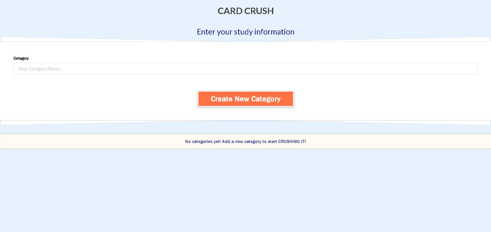
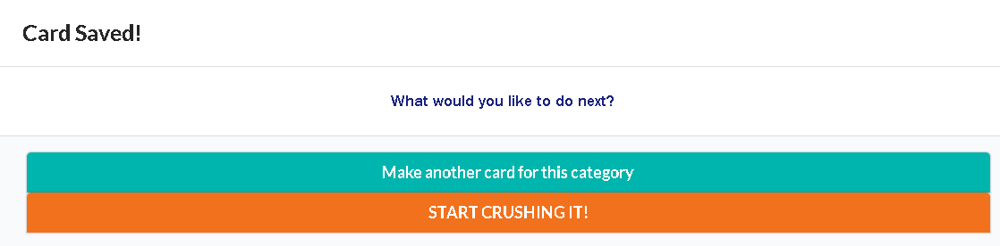

# Card Crush

## Description

Card Crush is a sleek and intuitive web application designed for students, professionals, and lifelong learners who need an efficient way to create, organize, and review flashcards. Acting as a digital rolodex of flashcards, Card Crush helps users retain knowledge, reinforce learning, and track progress—all within a beautifully designed, easy-to-use interface.

## Table of Contents

- [Usage](#usage)
- [Credits](#credits)
- [License](#license)

## Usage

Upon loading the page you are presented with a few options depending on your stored input.

You have the option to create a new category by typing in the input field and clicking the orange "Create New Category" button
If you have already created and viewed your category, you will find it below the "Create New Category" button

When you click "Create New Category" you are then shown another field to input text into the front and back of your flashcards

Upon creating a new card for your category, a popup message will introduce you to a few more options.

Here you are presented with the option to make another card that will live in the categery you previously created
or you can START CRUSHING IT! and study your flashcards!

When you START CRUSHING IT! you are presented with your flashcards as well as options to edit your category or delete the category entirely.

below your presented cards, you have the abilty to shuffle, add cards, or go back to the landing page
The option to "Crush" will delete the card from the category.
The "Next" option will allow the you to move on to the next card but keep the card in the category.

## Credits

Anthony Schwab - (https://github.com/ant-codes-42)
Kelly Hookham - (https://github.com/hookhamk)
Blake Anderson - (https://github.com/Blakeroband)

Semantic UI - (https://semantic-ui.com/)

## License

Copyright 2025 Anthony Schwab, Kelly Hookham, Blake Anderson

Permission is hereby granted, free of charge, to any person obtaining a copy of this software and associated documentation files (the “Software”), to deal in the Software without restriction, including without limitation the rights to use, copy, modify, merge, publish, distribute, sublicense, and/or sell copies of the Software, and to permit persons to whom the Software is furnished to do so, subject to the following conditions:

The above copyright notice and this permission notice shall be included in all copies or substantial portions of the Software.

THE SOFTWARE IS PROVIDED “AS IS”, WITHOUT WARRANTY OF ANY KIND, EXPRESS OR IMPLIED, INCLUDING BUT NOT LIMITED TO THE WARRANTIES OF MERCHANTABILITY, FITNESS FOR A PARTICULAR PURPOSE AND NONINFRINGEMENT. IN NO EVENT SHALL THE AUTHORS OR COPYRIGHT HOLDERS BE LIABLE FOR ANY CLAIM, DAMAGES OR OTHER LIABILITY, WHETHER IN AN ACTION OF CONTRACT, TORT OR OTHERWISE, ARISING FROM, OUT OF OR IN CONNECTION WITH THE SOFTWARE OR THE USE OR OTHER DEALINGS IN THE SOFTWARE.

## Features
- Create new category input adds input from the session storage to the local storage to contain an interactable list of created categories
- stored categories are located on the landing page below the create new category button and are interactible
- customizable front and back of cards based on user input
- ability to flip cards to show front and back triggered by user click
- edit feature on Rolodex page allows user to change cards inside of the category
- delete feature allows user to delete the category from the local storage
- crush button feature allows user to remove current card from the category
- next button feature allows the user to cycle through their cards
- shuffle button feature allows the cards to shuffle order for a more immersive study session
- '+' button allows the user to add new cards to the existing category
- '←' button allows the user to go back to the landing page from the Rolodex